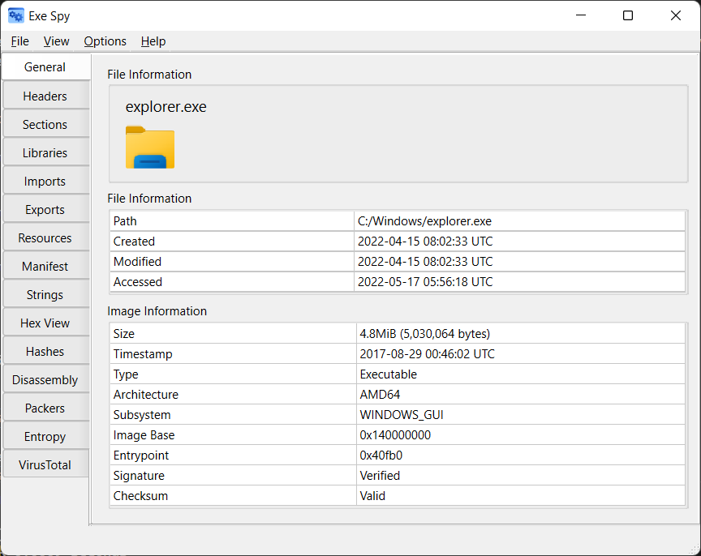
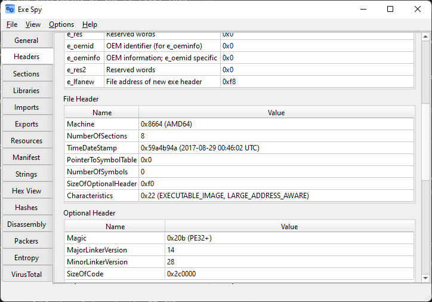
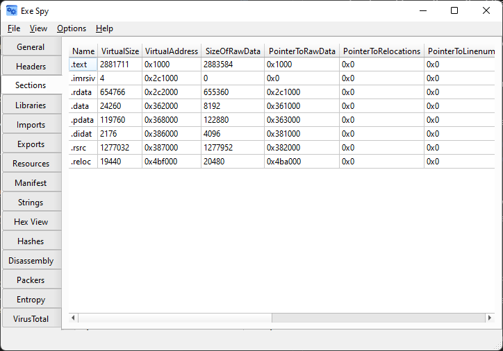
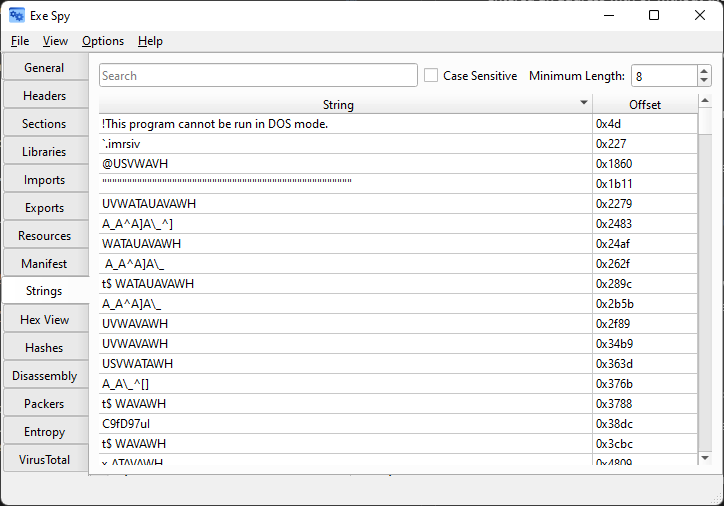
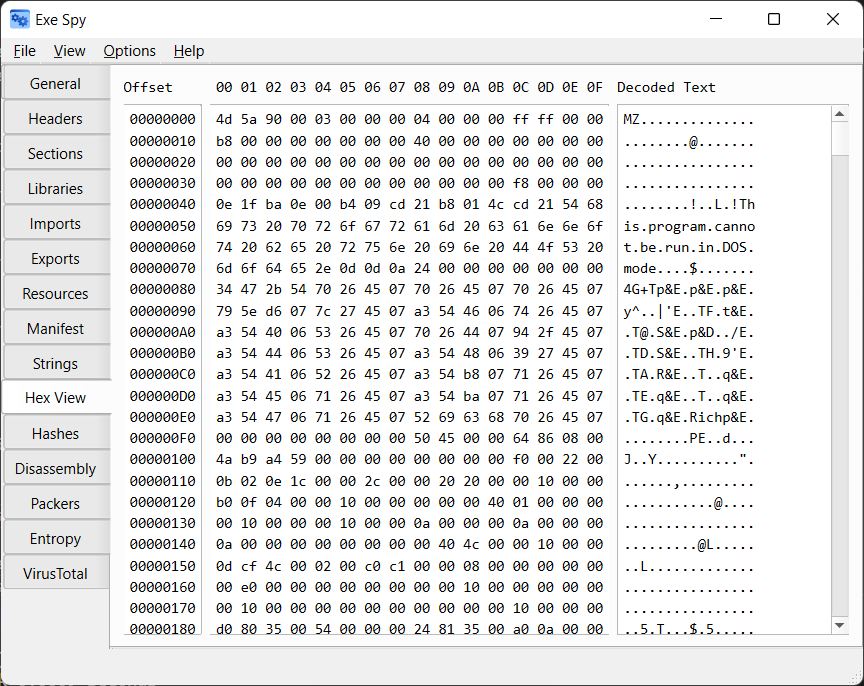
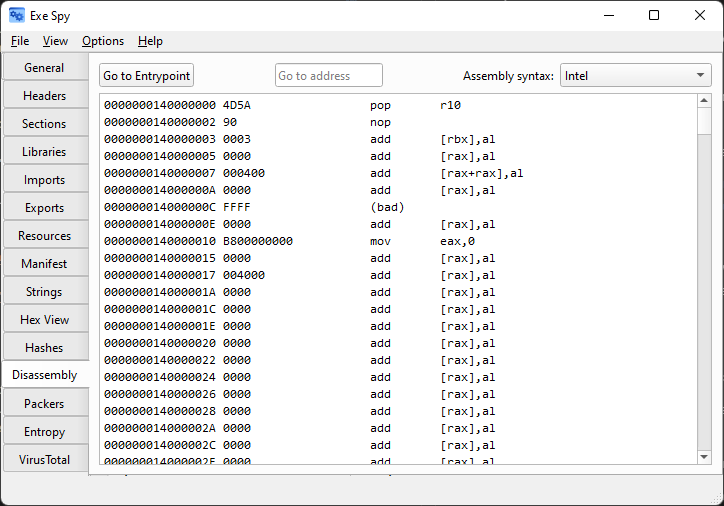
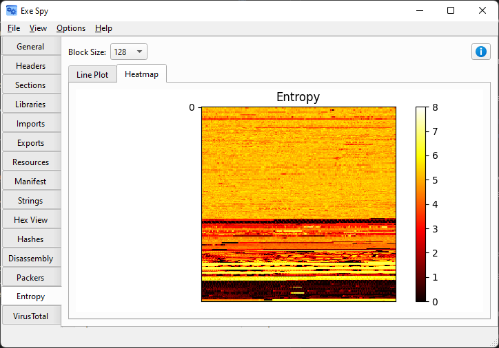

# ExeSpy: Cross-Platform PE File Viewer (EXE/DLL)

ExeSpy is a free, open-source cross-platform Windows PE file viewer. It supports all valid PE formats, including EXE, DLL, COM, OCX, SYS, SCR, CPL, AX, ACM, WINMD, MUI, EFI, TSP, and DRV.

It can view PE information, including:

- General information
- Headers
- Sections
- Libraries
- Imports
- Exports
- Resources
- Manifest

Additional functionality includes:

- Hashes of the file
- Viewing disassembly of x86/x64 PEs
- Hex viewer
- String search
- Identifying packers used to obfuscate the file
- VirusTotal searching
- Entropy analysis

## Requirements

- Python 3.8+
- Windows, macOS, or Linux (Windows 10 or higher if not using pre-built binaries)

## Installation

Download the latest version from the [releases page](https://github.com/andyjsmith/Exe-Spy/releases). Alternatively, use one of the following methods.

### pip (recommended)

1. `pip install exespy`
2. `exespy`

### Manual

1. `pip install -r requirements.txt`
2. `python setup.py install`
3. `exespy`

### Standalone

1. `pip install -r requirements.txt`
2. `python run.py`

## Usage

To open a PE file, use File->Open or Ctrl+O and select the file. The different tabs will load as they become available. Due to the nature of Python, larger executables may take a few seconds to load. I wouldn't recommend loading PE files larger than 50MB.

See the [documentation](#documentation) for more information.

## Screenshots

### General

### Headers

### Sections

### Strings

## Hex Viewer

### Disassembly

### Entropy

### VirusTotal

## Building

Dependencies:

- PyInstaller 4.5+

Regular building:
`pyinstaller exespy_install.spec`

Creating a single file:
`pyinstaller exespy_onefile.spec`

## Documentation

The menu bar has various options.

- File
  - Open PE: open a PE file
  - Quit: exit the program
- View
  - Use native style: toggle between native (OS) theme and the Qt fusion theme
- Options
  - Set VirusTotal API Key: set your VirusTotal API key
- Help
  - About: version and license information
  - Third-Party Licenses: licenses for third-party libraries used by ExeSpy

### General

The general tab shows general information about the PE file. If available, it attempts to show the file's icon, though this may pick the wrong or lower resolution icon.

The file information table shows file metadata. This is not embedded in the PE, but from the filesystem.

The image information table shows common information from within the PE. The signature verification row uses the LIEF library to verify the PE's digital signature. It does NOT verify that the PE was signed with a trusted certificate, just that the signature is valid. The checksum row calculates a checksum for the PE and compares it to the PE's embedded checksum. Some PEs don't include a checksum, so this row may show as invalid when the checksum isn't included and set to 0x0.

### Headers

The headers tab shows the DOS, file, and optional headers from the PE file. The DOS section includes both the name from the internal PE structure and a description of what it represents, since the given name can be difficult to understand.

The Characteristics and DLLCharacteristics rows show the characteristics that were parsed out from the raw value.

### Sections

The sections tab shows the sections inside the PE file and all of their properties. This includes deprecated section header variables like PointerToLinenumbers for thoroughness. The characteristics column shows the section characteristics. In particular is MEM_EXECUTE, which means that the section is executable.

### Libraries

The libraries tab shows the libraries that are loaded by the PE file as a result of the import table. It also displays the number of functions that are imported from each library.

### Imports

The imports tab shows the functions the PE file imports through the DLL entries in the import directory table (.idata). It also shows the corresponding DLL name and address of the function.

### Exports

The exports tab shows the functions the PE exports (.edata). This includes the function's name, ordinal value (if used by ordinal importing instead of by name), and the address of the function.

If the PE doesn't export any functions, this tab will be empty.

### Resources

The resources tab shows all of the resources in the PE resource table (.rsrc). This includes the type of the resource, its ID, offset, language, and sublanguage. ExeSpy also uses libmagic to calculate the magic for the resource. This is useful for identifying the type of resource.

To save an individual resource for further analysis, right-click on it and click Save.

### Manifest

The manifest tab extracts the PE's manifest from its resources if it has one. This includes some metadata and important information about how the file works. For example, the `requestedExecutionLevel` property shows if the file will run with higher privileges and will be set to `highestAvailable` or `requireAdministrator` if so.

If no manifest was found, this tab will be empty.

### Strings

The strings tab searches for strings of ASCII characters inside of the PE file, similar to the UNIX `strings` command. It also shows the offset the string was found at.

You can filter the list by typing in the search box. You can also click on the column headers to change the sort order.

By default, the search is case insensitive. You can change this by clicking the case sensitive checkbox.

To configure how many ASCII characters are needed in a row before it is considered a string, change the minimum length.

### Hex View

The hex view tab is a basic hex viewer for the PE file. The columns are the offset from the start of the file, the hex values, and an ASCII decoding of the hex values.

Since Python and Qt are fairly slow together, this tab may take a while to load.

### Hashes

The hashes tab shows many different hashes of the PE file. These include:

- CRC32
- MD5
- SHA1
- SHA224
- SHA256
- SHA384
- SHA512
- SHA3-224
- SHA3-256
- SHA3-384
- SHA3-512
- BLAKE2s
- BLAKE2b

It also includes other specialized hashes. The imphash is calculated from the import table. The authentihashes are hashes of the authenticode signature. [More info.](https://lief-project.github.io/doc/stable/tutorials/13_pe_authenticode.html#exploring-pkcs-7-signature)

### Disassembly

The disassembly tab uses [iced-x86](https://github.com/icedland/iced) to disassemble the PE file. It shows the address, hex of the full instruction, opcode, and operands.

The Go to Entrypoint button jumps to the entrypoint of the PE file. This is useful since the first lines in the disassembly are going to be incorrectly disassembled versions of the PE headers.

You can jump to a specific address by entering it into the textbox. It intelligently determines whether you entered an address with or without the image base included, so you can either include the image base or not.

You can also specify which assembly syntax you want the disassembly to use. By default, it uses Intel syntax.

### Packers

The packers tab uses Yara to search for packers that may have been used to obfuscate the PE file, as well as other information. The source column shows where each detection came from.

The Yara rules come from PEiD (using a pre-compiled peid2yara.py export) and the following repositories:

- [https://github.com/godaddy/yara-rules](https://github.com/godaddy/yara-rules)
- [https://github.com/Yara-Rules/rules](https://github.com/Yara-Rules/rules)

### Entropy

The entropy tab calculates the entropy of blocks of data in the PE file. You can specify the size of the block to use. The line plot sub-tab shows the entropy of the file as a whole. The heatmap sub-tab shows the entropy as a color from black to white in a 2D grid.

More on entropy:

Entropy is a measure of the randomness in the loaded PE file.

Shannon entropy is scaled between 0 and 8 bits per byte.

- 0 means the data is uniform
- 8 means the data is completely random

Entropy can indicate what kind of data is in the file.

- Higher entropy values may indicate encrypted or compressed data sections
- Plaintext generally has 3.5 to 5 bits of entropy per byte

The block size indicates how many bytes to read at a time and calculate entropy for. Each block's entropy is calculated and then plotted in the charts.

### VirusTotal

The VirusTotal tab shows the VirusTotal report for the PE file. This is useful for finding out if the file has been scanned before, and if it has, it shows the results. To get the results, you need to click on the button. This is to save on excess requests with your API key.

If the file hasn't been scanned before, you can click OK to open VirusTotal.com where you can scan it there.

To use this tab, you need to get a free VirusTotal API key. Register for an account and then go to `https://www.virustotal.com/gui/user/YOUR_USERNAME/apikey` to get your API key. In ExeSpy, go to Options->Set VirusTotal API Key and paste it there.

## License

ExeSpy

Copyright (C) 2022 Andy Smith

This program is free software: you can redistribute it and/or modify
it under the terms of the GNU General Public License as published by
the Free Software Foundation, either version 3 of the License, or
(at your option) any later version.

This program is distributed in the hope that it will be useful,
but WITHOUT ANY WARRANTY; without even the implied warranty of
MERCHANTABILITY or FITNESS FOR A PARTICULAR PURPOSE. See the
GNU General Public License for more details.

You should have received a copy of the GNU General Public License
along with this program. If not, see <https://www.gnu.org/licenses/>.
